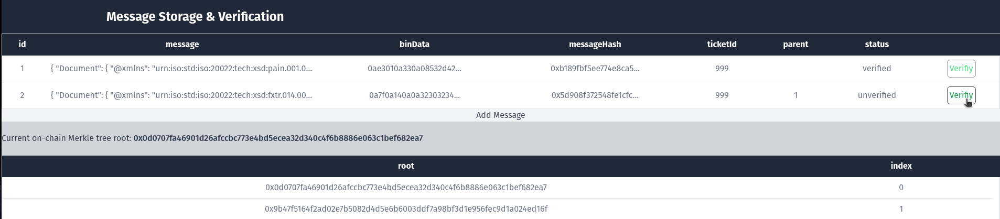
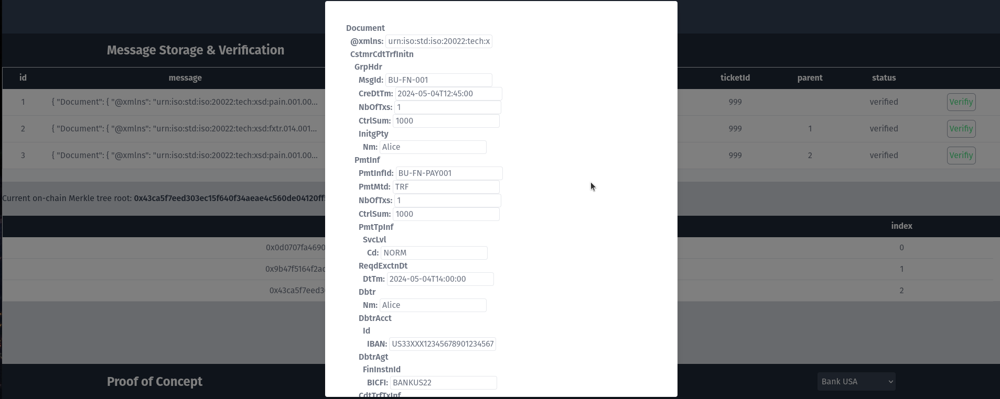
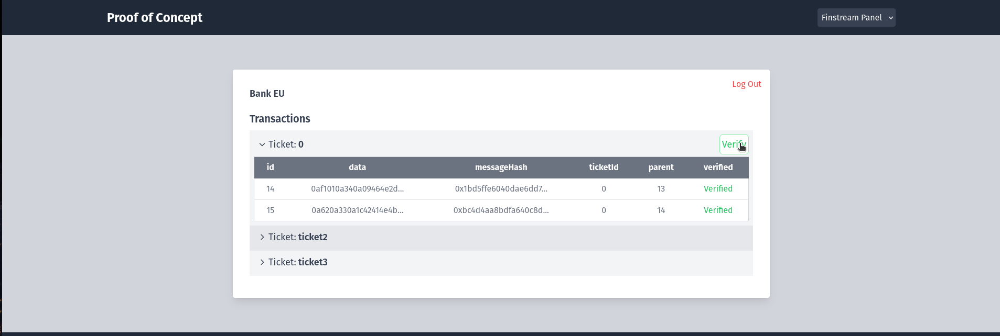

# About Finstream Network

Finstream is a PoC to showcase a seamless cross-border payments using blockchain technology. It provides a secure, efficient, and transparent way to transfer money internationally.

## How the Message Verification Works

In the **Message Storage & Verification** section you can add and verify example messages.

1. **message** is a message according to the ISO20022 standard.
2. **binData** is the same message stored in binary.
3. **messageHash** is the keccak256 hash of the binary data.
4. **ticketId** is the ID the ticket associated with these messages would have on the blockchain.
5. **parent** refers to the message that is the immediate predecessor of the message.
6. **status** shows if the validity of the message has been verified. There are three possible states:
   - *unverified*
   - *verified*
   - *corrupted*
7. The **verify** button checks each of the messages individually against the *current selected root*.

The initial status of each message is *unverified*.


Clicking the **verify** button changes the status of the message to *verified* if it is valid.

The validity gets checked by building the Merkle tree locally with all message hashes and creating a proof with the selected hash. This proof then gets verified against root which is stored on-chain.


Adding a new message the Merkle tree gets re-calculated and a new root saved on-chain.


Every time a root for a ticket is updated it also gets logged. This enables a potential auditor to traverse the messages and verify them against each individual root.

In the example shown below the first root is selected, after both messages have been successfully verified against the current on-chain root.


Checking both messages against the selected historical root shows that the first message remains valid while the new message cannot be verified against it.



Here we are adding a third message and successfully verifying the messages against the new root.


Now we open the message and tamper with it, changing the time of the message creation from 12:38...


...to 12:45, updating the stored binary and message hash in the process.

Only the binary gets stored in the actual PoC. The message hash then gets calculated from the binary. tampering with the data always includes a change in the message hash.

In the PoC we assume that a malicious actor cannot update the on-chain root with falsified data. This is not enforced in the current implementation but could be done by building the tree itself on-chain instead of just passing the new root.

To prevent a malicious actor from falsifying data from the start there would have to be additional checks. This method only serves to protect against after-the-fact data tampering.



Trying to verify the messages against the on-chain root all of the messages return *corrupted*, signaling that one or more of the messages have been tampered with.


Now we can select older roots to try and find out which messages are still valid.


The last root returns verifies all of the older messages which means that the last message has been corrupted.


### Potential Problems

- **Problems:**
  - Scalability concerns due to transaction costs and time as the blockchain grows.
  - Dependence on accurate initial data entry, as errors are permanently recorded due to blockchain's immutability.
  - Tampering with multiple data entries could be used to mask actual data tampering, complicating detection and correction.

## Example Transaction POC

In the **Proof of Concept** section a cross-border transaction utilizing the Finstream Network can be simulated. This simulation includes multiple parts:

- **Gateway server** responsible for storing and verifying messages and facilitating blockchain interactions.
- **Mockup Banks**:
  - Bank USA
  - Bank EU
- **Local Node of the Sepolia test network** with deployed [smart contracts](./smart-contracts/README.md):
  - Controller
  - MsgTicket
  - Treasury

The example below will showcase a x-border bank transfer from the USA ($) to Europe (€).

1. Log in as Alice in the mockup bank in the USA.


2. Select the amount to transfer and choose a recipient (here Bob).


3. Alice can now follow the transaction in real-time as it goes through multiple steps:

   - The bank handles the transaction in their own system, charging the account of the sender.
   - Alice can now see that the transaction has been started.
   - Bank USA acting as the debtor agent for Alice mints a ticket with the Controller contract where it is listed as a client of the Finstream Network.
   - The first ISO20022 message is sent to the Finstream gateway, where its validity is checked and then it is converted to binary and stored.
   - A Merkle tree is created from the singular message hash and the root gets updated on chain.
   - Alice can now see that the transaction has been forwarded.
   - The Finstream Gateway now checks the current exchange rate on-chain.
   - The Finstream Gateway sends an ISO20022 compliant message with the proposed exchange rate to Bank USA.
   - The new message gets saved in binary and the root on chain gets updated.
   - Alice can now see that the exchange rate has been set.
   - Accepting the exchange rate, Bank USA sends another message initiating the transaction.
   - The new message gets saved in binary and the root on chain gets updated.
   - The Finstream Gateway sends a message to Bank EU.
   - The new message gets saved in binary and the root on chain gets updated.
   - Alice can now see that the funds are being transferred.
   - The funds are transferred on-chain using USDC and EURC stablecoins.
   - Bank EU sends a message confirming the reception of funds.
   - Bank EU credits Bob's bank account.
   - The new message gets saved in binary and the root on chain gets updated.
   - Alice can now see that the transaction has been completed successfully.
   - Bob can now see that the transaction has been completed successfully.


4. The transfer is now complete.


5. Verifying Bob from the EU mockup bank received the appropriate amount in € according to the current $/€ exchange rate.


6. The messages are stored and updated in real time on the Finstream gateway.

- **data** is a ISO20022 conform message in binary.
- **messageHash** is the keccak256 hash of the binary data.
- **ticketId** is the ID the ticket (NFT) associated with these messages on the blockchain (0 in our example).
- **parent** refers to the message that is the immediate predecessor of the message.
- **verified** shows if the message is valid. There are three possible states:
  - *unverified*
  - *verified*
  - *corrupted*


7. The Finstream Panel is hosted by the Gateway server for its clients (banks) to keep track of and verify transactions.

The transactions are associated with a ticket (NFT) minted to the account of the issuing debtor agent (in this example the bank USA).

Every account can see the messages associated with them. Even if they did not issue them.


8. The messages can be verified against the merkle root stored on chain as explained in the prior section.


9. And Bank EU can also see and verify its associated messages.



### Additional Information

This example is highly simplified and just serves to demonstrate the base functionalities of utilizing blockchain technologies for x-border payments. As it stands now there are some caveats with the implementation of the Gateway and its smart contracts:

- Only the debtor agent is capable of adding messages to a ticket. This can be adjusted with e.g. a mapping authorizing other involved entities to add messages to a ticket.
- In the PoC there is no option to tamper with the data and the verification process itself in the Finstream Panel does not check against the roots stored on-chain. This is for simplification as the verification process is already explained in the previous section.
- The Treasury contract is highly simplified and just facilitates the transfer of the Mockup USDC and EURC stable coins with basically unlimited funds. A more sophisticated AMM could be integrated here for improved price discovery and to ensure liquidity.

## Setup

This project is structured into several directories where dependencies need to be installed independently. Here are the steps for setting up each component:

### Smart Contracts
Navigate to the `smart-contracts` directory. This is a standard Hardhat project.
```bash
cd smart-contracts
npm install
npx hardhat compile
```

### ISO20022 Message Gateway

Navigate to the iso20022-message-gateway directory. This is a monorepo that requires pnpm to handle multiple packages
```bash
cd iso20022-message-gateway
pnpm install
```

Additionally read through and follow the pre-requisites in the [README](./iso20022-message-gateway/README.md).

### Frontend

Navigate to the frontend directory. This directory contains a Nuxt 3 application.
```bash
cd frontend
pnpm install
```

### Testing the Setup

To fully test the setup, the following services need to be running:

 1. Gateway server hosting a database and enabling the capabilities of the packages in the monorepo.
 2. Mockup bank server.
 3. Local node of the Sepolia test network.
 4. Deployment of smart contracts to the local node.
 5. Start of the Nuxt 3 app in development mode on localhost:3002.

These services can be started automatically by running:
```bash
chmod +x start_services.sh
./start_services.sh
```

## License

This project is licensed under the Apache License 2.0. Please note that while every effort has been made to ensure the accuracy and reliability of the software, I do not take any responsibility for any problems that may arise from its use.

## Acknowledgements

This project was inspired by the ideas discussed in a paper on cross-border payments using ISO20022 messages on blockchain technology. You can read more about the concepts and methodologies that influenced this project [here](https://medium.com/@0xrwas/cross-border-payment-proof-of-concept-supporting-iso20022-messages-on-the-polkadot-blockchain-3846910fc8de).